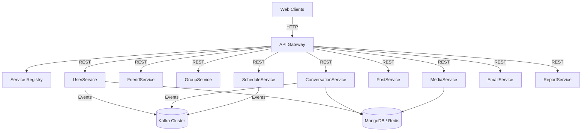

# UteAlo Microservice Platform 🚀
**Slogan:** Enabling seamless social interactions through resilient microservices.
---
## 📚 Table of Contents
- [Introduction](#-introduction)
- [Features](#-features)
- [Tech Stack](#-tech-stack)
- [Architecture](#-architecture)
- [Installation](#-installation)
- [Configuration](#-configuration)
- [Usage](#-usage)
- [Running Tests](#-running-tests)
- [Contributing](#-contributing)
- [License](#-license)
- [Author & Contact](#-author--contact)
## 🧭 Introduction
UteAlo Microservice Platform is a cloud-ready social networking ecosystem designed to connect communities, streamline communication, and deliver a delightful user experience. The project was created to solve the challenge of scaling feature-rich social interactions across multiple domains—messaging, media sharing, scheduling, and reporting—without compromising performance or developer productivity. Targeting engineering teams and platform integrators, UteAlo stands out for its modular design, robust observability, and event-driven workflows that simplify customization and rapid iteration.
## ✨ Features
- **Comprehensive User Management:** Handle registration, authentication, authorization, and profile management with fine-grained role control.
- **Real-time Conversations:** Power instant messaging, group chats, and notification delivery with resilient messaging pipelines.
- **Rich Media Handling:** Upload, store, transform, and distribute media assets efficiently with CDN-ready endpoints.
- **Event-driven Scheduling:** Coordinate events, reminders, and calendar synchronization backed by distributed job orchestration.
- **Insightful Reporting:** Aggregate metrics, audit trails, and user activity analytics for data-driven decisions.
- **Extensible Integrations:** Seamless email delivery, third-party service hooks, and Kafka-based extensibility for new domains.
## 🛠 Tech Stack
- **Backend:** Java 17, Spring Boot 3, Spring Cloud Gateway, Spring Security, Spring Data JPA, Cloudinary SDK.
- **Database:** MongoDB, Redis (caching and session store).
- **Message Broker:** Apache Kafka.
- **DevOps:** Docker, Docker Compose, Kubernetes (manifests-ready), Prometheus, Grafana, GitHub Actions.
- **Frontend:** React, Redux Toolkit, Tailwind CSS (optional client portal).
- **Testing:** JUnit 5, Mockito, Testcontainers.
## 🏗 Architecture
The platform adopts a microservices architecture segmented into domain-driven services such as `user-service`, `friend-service`, `group-service`, `conversation-service`, `schedule-service`, `post-service`, `media-service`, `email-service`, and `report-service`. Service discovery is handled by `discovery-server`, while `api-gateway` offers a unified entry point, rate limiting, and security enforcement. Synchronous REST communication is complemented by asynchronous event distribution through Kafka topics, ensuring resilience and scalability.

## 🧑‍💻 Installation
1. Clone the repository: `git clone https://github.com/81quanghuy/system_utealo_microservice.git`
2. Navigate to the project directory: `cd system_utealo_microservice`
3. Duplicate `.env.example` into `.env` and adjust values for your environment.
4. Start infrastructure dependencies: `docker-compose up -d`
5. Build all modules with Maven: `./mvnw clean install`
6. Start individual services as needed (see Usage section).
7. Access the API Gateway at `http://localhost:8080`.
8. Monitor services via Prometheus and Grafana dashboards.
## ⚙️ Configuration
Configure the following environment variables before running services:
- `DATABASE_URL`: JDBC connection string for the primary relational database.
- `MONGO_URI`: Connection URI for MongoDB (media metadata, conversations).
- `REDIS_HOST`: Hostname for Redis cache cluster.
- `KAFKA_BROKER_URL`: Kafka bootstrap servers for event streaming.
- `JWT_SECRET_KEY`: Secret key for signing and verifying JWT tokens.
- `MAIL_HOST`, `MAIL_USERNAME`, `MAIL_PASSWORD`: SMTP configuration for the email service.
- `MINIO_ENDPOINT`, `MINIO_ACCESS_KEY`, `MINIO_SECRET_KEY`: Object storage credentials for media assets.
- `PROMETHEUS_ENDPOINT`: Endpoint where Prometheus scrapes metrics.
## ▶️ Usage
- **Run services:** `java -jar service-module/target/service-module.jar` (replace `service-module` with the desired service, e.g., `user-service`).
- **API Gateway:** Access the gateway at `http://localhost:8080` for aggregated APIs.
- **API Documentation:** Swagger UI available per service at `http://localhost:<service-port>/swagger-ui.html` once the service starts.
- **Demo Accounts:**
    - Admin: `admin@utealo.com` / `admin!123`
    - User: `user@utealo.com` / `admin!123`
## ✅ Running Tests
Execute the following command from the project root:
```bash
./mvnw test
```
## 👤 Author & Contact
- **Team:** UteAlo Platform Team
- **Email:** ngoquanghuy0310@gmail.com
---
Made with ❤️ to empower meaningful digital connections.
